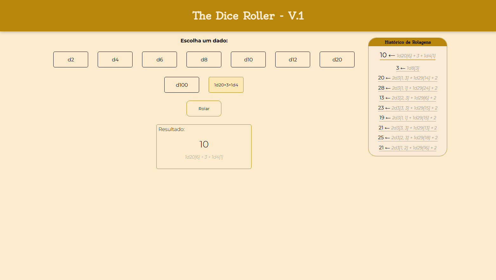

# 🎲 RPG Dice Roller

Um simulador interativo de dados para RPG de mesa desenvolvido com **HTML5, CSS3 e JavaScript Vanilla**. Projeto focado em manipulação do DOM e lógica de negócio com interface responsiva e animações fluidas.

**🔗 Demo ao vivo:** [Ver demonstração](https://murianKVS.github.io/rpg-dice-roller)

---

## 📋 Sobre o Projeto

Este projeto permite que usuários rolem diferentes tipos de dados utilizados em sistemas de RPG (Dungeons & Dragons, Pathfinder, etc.), oferecendo uma experiência interativa com animações, histórico de rolagens e detecção automática de resultados críticos. Ideal para mestres e jogadores durante campanhas.

---

## ✨ Funcionalidades

- **🎲 Múltiplos tipos de dados:** d2, d4, d6, d8, d10, d12, d20, d100
- **🔢 Dados personalizados:** Suporte a expressões como `2d6+3` ou `d20+5`
- **📜 Histórico:** Rastreamento das últimas 10 rolagens com detalhes
- **🔥 Detecção de Crítico:** Realça resultado máximo (20 em d20)
- **💀 Falha Crítica:** Realça resultado 1 em d20
- **🎨 Feedback Visual:** Cores e estilos distintos para críticos e falhas críticas
- **📱 Interface Responsiva:** Otimizado para desktop e dispositivos móveis

---

## 💻 Tecnologias Utilizadas

| Tecnologia | Descrição |
|-----------|-----------|
| **HTML5** | Estrutura semântica da página |
| **CSS3** | Estilização com flexbox, animações e responsividade |
| **JavaScript (ES6+)** | Lógica de negócio e manipulação do DOM |
| **Google Fonts** | Tipografia: Montserrat, Open Sans, Oldenburg |

---

## 🎓 Conceitos Praticados

### Frontend
- ✅ Manipulação do DOM com JavaScript vanilla
- ✅ Event listeners e tratamento de eventos
- ✅ Geração de números aleatórios
- ✅ Manipulação dinâmica de elementos HTML
- ✅ Expressões regulares para validação de entrada

### Lógica de Negócio
- ✅ Gerenciamento de estado (histórico de rolagens)
- ✅ Funções reutilizáveis e modularização
- ✅ Parsing de expressões matemáticas customizadas
- ✅ Tratamento de erros com try/catch

### UX/Design
- ✅ Feedback visual com animações CSS
- ✅ Estados de componentes (selected, last, critic, criticFail)
- ✅ Design responsivo com media queries
- ✅ Interface intuitiva e acessível

---

## 📸 Demonstração



---

## 🚀 Como Usar

### Instalação
```bash
git clone https://github.com/MurianKVS/rpg-dice-roller.git
cd rpg-dice-roller
```

### Execução
Abra o arquivo `index.html` no navegador (não requer servidor)

### Uso da Aplicação
1. **Dados Pré-definidos:** Clique em um dos botões de dados (d2, d4, d6, etc.)
2. **Dados Customizados:** Digite uma expressão no campo personalizado:
   - `d20` - Um d20
   - `2d6` - Dois d6
   - `3d10+5` - Três d10 mais 5 pontos
   - `2d6+1d8+3` - Combinações de múltiplos dados
3. **Rolar:** Clique no botão "Rolar" para gerar o resultado
4. **Histórico:** Última 10 rolagens são exibidas na seção de histórico

---

## 📁 Estrutura do Projeto

```
rpg-dice-roller/
├── index.html       # Estrutura HTML
├── styles.css       # Estilos e animações
├── scripts.js       # Lógica JavaScript
├── readme.md        # Este arquivo
└── src/
    └── image.png    # Screenshot para demonstração
```

---

## 🔮 Possíveis Melhorias Futuras

- [ ] Suportar modos de roda diferenciados (estatísticas, etc.)
- [ ] Temas dark/light
- [ ] LocalStorage para persistir histórico
- [ ] Adicionar sons de rolagem

---

## 📄 Licença

Este projeto é de código aberto e pode ser utilizado livremente para fins educacionais e pessoais.